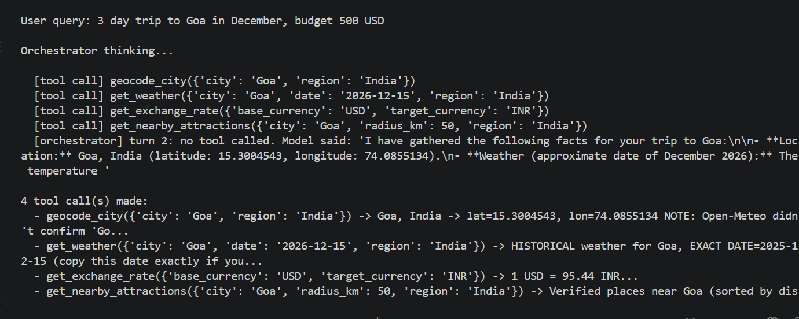
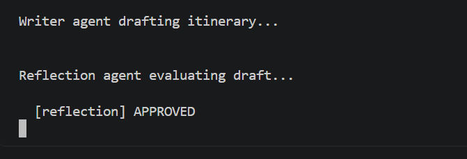
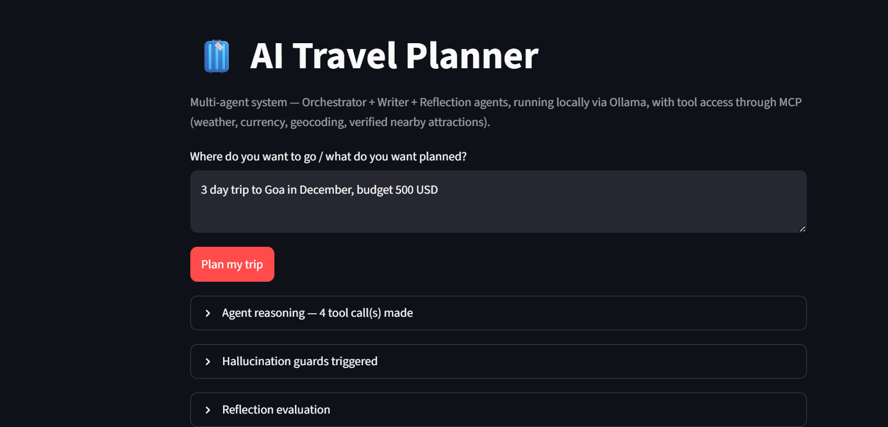
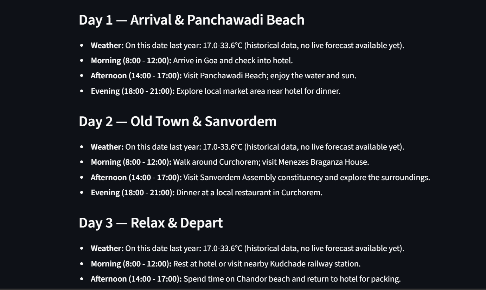

# AI Travel Planner — Multi-Agent System (Local LLM + MCP)

A 3-agent AI system that plans travel itineraries, running on local LLMs
via Ollama and reaching external tools through the Model Context Protocol
(MCP). No paid APIs, no external LLM calls, no API keys required.

## Agents

- **Orchestrator Agent** (`qwen2.5:7b-instruct`) — reasons about your
  query and decides, via native tool-calling, whether it needs live data.
  Runs a ReAct loop (reason → act → observe → repeat).
- **Writer Agent** (`qwen2.5:7b-instruct`) — takes the gathered research
  and writes the final Markdown itinerary. Never calls tools.
- **Reflection Agent** (code-level, deterministic) — evaluates the draft
  itinerary against the actual fetched data. Flags hallucinated weather
  numbers, place names not in the verified list, or exchange rates that
  weren't fetched. May request a revision cycle.

All three agents use the same `qwen2.5:7b-instruct` model. The Reflection
is NOT an LLM call — it is deterministic Python string/regex checks, so it
can never itself hallucinate.

## Tools (via MCP)

- `geocode_city` — location lookup with region disambiguation
  (Open-Meteo primary + Nominatim/OSM fallback for better India/town coverage)
- `get_weather` — live forecast (trips ≤15 days out) or real historical
  data (further out), never a guess (Open-Meteo Forecast/Archive)
- `get_exchange_rate` — live currency conversion (Frankfurter)
- `get_nearby_attractions` — real, distance-verified places (Wikipedia
  geosearch)

## Hallucination guards (three layers)

1. **Prompt engineering** — Writer and Orchestrator prompts forbid fabrication.
2. **Code-level hard guards** — If a tool wasn't called or failed, `main.py`
   injects an unmissable directive forbidding the Writer from inventing
   that category of fact. Also suppresses cross-currency display when the
   user never asked for a conversion.
3. **Reflection agent** — Deterministic code-level checks that compare the
   draft against the actual tool output (weather numbers, allow-listed
   place names, requested currencies). Requests a revision if violated.

## Project structure

```
travel-agent/
├── app.py                     # Streamlit UI
├── main.py                    # CLI entry point + preflight + guards + pipeline
├── orchestrator.py            # Orchestrator agent (ReAct loop)
├── writer_agent.py            # Writer agent (Markdown formatting)
├── reflection_agent.py        # Reflection (deterministic code-level checks)
├── mcp_server.py              # MCP server exposing the 4 tools
├── mcp_client.py              # MCP client wrapper
├── requirements.txt           # Python dependencies (pinned)
├── .gitignore                 # Ignores venv/, __pycache__/, .pytest_cache/
├── demo_transcript.md         # Walkthrough of a complete agent run
├── README.md
├── screenshots/               # Evidence of working system (see below)
└── tests/                     # Unit tests (39 tests, all pass)
    ├── __init__.py
    ├── test_geocode.py        # Geocoding disambiguation + region matching (9 tests)
    ├── test_mcp_tools.py      # MCP tool function smoke tests (6 tests)
    ├── test_guards.py         # Hallucination guard logic (10 tests)
    ├── test_reflection.py     # Reflection checks (11 tests)
    └── test_invalid_query.py  # INVALID_QUERY rejection (4 tests)
```

> **Committed to GitHub:** All files above.
> **Gitignored (not committed):** `venv/`, `__pycache__/`, `*.pyc`, `.pytest_cache/`, `changes_understanding.md`

## Setup

1. Install [Ollama](https://ollama.com), then pull the model:
   ```bash
   ollama pull qwen2.5:7b-instruct   # Orchestrator + Writer + Reflection
   ```

2. Create a virtual environment and install dependencies:
   ```bash
   python -m venv venv
   source venv/bin/activate      # Windows: venv\Scripts\Activate.ps1
   pip install -r requirements.txt
   ```

3. Run it:
   ```bash
   python main.py          # CLI
   streamlit run app.py    # or Streamlit UI
   ```

4. Run tests:
   ```bash
   pytest tests/ -v
   ```

## Evidence / Proof of Working System

This section demonstrates that the pipeline runs end-to-end and produces
real, tool-grounded output — not just that the code compiles.

### 1. CLI run — full ReAct loop + final itinerary

Shows the Orchestrator making tool calls (geocode → weather → attractions),
the Writer producing the draft, and the Reflection agent approving it.

```
screenshots/L2_SS_1.png
screenshots/L2_SS_2.png
```




### 2. Streamlit UI — same query, rendered in the browser

```
screenshots/L2_SS_3.png
screenshots/L2_SS_4.png
```




## L2 Review Context

### Architecture Overview

A multi-agent AI system for travel itinerary generation using local LLMs (Ollama) and the Model Context Protocol (MCP).

### Agents

| Agent | Model | Role |
|-------|-------|------|
| Orchestrator | `qwen2.5:7b-instruct` | ReAct loop: decides tool calls, gathers research |
| Writer | `qwen2.5:7b-instruct` | Formats research into Markdown itinerary |
| Reflector | code-level checks | Deterministic validation of draft vs fetched data |

### MCP Tools (all free, no API keys)

| Tool | API | What it does |
|------|-----|-------------|
| `geocode_city(city, region)` | Open-Meteo Geocoding + Nominatim | City → lat/lon with region disambiguation |
| `get_weather(city, date, region)` | Open-Meteo Forecast/Archive | Live forecast (≤15 days) or historical data |
| `get_exchange_rate(base, target)` | Frankfurter | Live currency conversion |
| `get_nearby_attractions(city, radius, region)` | Wikipedia Geosearch | Real, distance-verified POIs |

### Hallucination Guards

1. **Code-level hard guards** (`main.py`): If a tool was never called or failed, an explicit directive is injected into the Writer's context, forbidding it from inventing that category of data.
2. **Reflection agent**: Reviews the draft against the actual research data. Flags temperature numbers not in fetched weather, place names not in verified list, exchange rates not fetched, etc.
3. **Prompt engineering**: Both Writer and Orchestrator prompts contain strict constraints against fabrication.

### Key Design Decisions

- **One model everywhere**: All three agents use `qwen2.5:7b-instruct`. The
  original plan used a 3B for the orchestrator/reflection (faster) and 7B
  for the writer, but 3B proved unreliable at tool-calling and at following
  the reflection instructions (misspelled regions, skipped tools, bogus
  "no weather data" flags). Upgrading everything to 7B fixed these.
- **Deterministic reflection instead of an LLM reviewer**: The 7B model
  still hallucinated when asked to "review" the draft (it flagging the
  geocode coordinates as weather data). Replaced with pure Python checks
  — 100% reliable, instant, and still demonstrates the review step.
- **MCP boundary**: Agent never calls HTTP directly — goes through MCP stdio
  session. Decouples tools from agent logic.
- **Region-based geocoding with fuzzy matching**: Pass region (state/country)
  to disambiguate city names. Region matching uses containment in BOTH
  directions (`"United States of America"` matches Open-Meteo's `"United
  States"`) so every tool call resolves to the SAME location. Nominatim
  (OSM) is the fallback when Open-Meteo can't confirm a region — this is
  what makes "Goa, India" resolve to the Indian state instead of Genoa.
- **Orchestrator infers region from knowledge**: The prompt tells the model
  to infer a country/region when the user doesn't give one ("Goa" →
  `region='India'`), and to NEVER pass the city name as its own region.
- **Preflight check**: On startup, verifies the Ollama model exists and
  Ollama is running. Gives clear install instructions if missing.
- **Safe cleanup**: MCP client lifecycle wrapped in `try/finally` to prevent
  noisy subprocess/session failures.
- **`sys.executable` for the MCP subprocess**: The client launches
  `mcp_server.py` using the same Python interpreter (`sys.executable`)
  instead of a hardcoded `"python"`, so it works inside any venv.

### Reflection Design

The reflection agent (`reflection_agent.py`) is deterministic — no LLM call.
It runs three regex/string checks after the Writer:

1. **Weather check**: If research notes contain `HISTORICAL weather for`
   or `LIVE forecast for`, weather WAS fetched. If neither is present but
   the draft cites temperature numbers, flag it.
2. **Attraction allow-list check**: Parse the `*** ALLOW-LIST ***` guard
   from the research notes. Flag any place-phrase in the draft whose
   leading word OR type word (Temple/Beach/Fort/...) does not appear in
   any allow-listed name. (Handles `Visit Cathedral of Saint Étienne`
   correctly — "Cathedral" matches the allow-list — while still catching
   `Visit Eiffel Tower` when Eiffel Tower was never fetched.)
3. **Currency check**: Determine which currencies the user mentioned in
   their query. If the notes say no exchange rate was fetched, or that the
   user did NOT ask for conversion, flag any currency symbol in the draft
   the user never asked about. (A "budget 500 USD" query showing `$500` is
   fine — `$` is what the user wanted.)

Returns `APPROVED` or `REVISE: <specific issues>`. If `REVISE`, the Writer
regenerates with the issues added to context (max 1 revision cycle).

## Architecture

```
User query (CLI or Streamlit)
      │
      ▼
Orchestrator Agent  ───MCP (stdio/JSON-RPC)───►  MCP Server
(qwen2.5:7b, ReAct   ◄──────tool results──────    - geocode_city
 loop, decides                                    - get_weather
 tool calls)                                      - get_exchange_rate
      │ research notes                            - get_nearby_attractions
      ▼
Code-level hard guards (main.py)
      │
      ▼
Writer Agent (qwen2.5:7b, formatting only, no tools)
      │ draft itinerary
      ▼
Reflection (deterministic Python checks, no LLM)
      │
      ├── APPROVED ──► Final Markdown itinerary → CLI or Streamlit UI
      │
      └── REVISE ────► Writer regenerates (max 1 revision cycle)
                           │
                           ▼
                       Final output
```

## Known limitations

- Local 7B models are still not 100% reliable at tool-calling — occasionally
  they skip a call they should have made, or pass an approximate date when
  the user gives no month.
- `get_nearby_attractions` uses Wikipedia geosearch (nearest-by-distance),
  not a curated "top tourist attractions" ranking. In central London it may
  return obscure nearby articles (e.g. the College of Optometrists) instead
  of Big Ben. This is a deliberate tradeoff: verified-but-obscure beats
  famous-but-unverified.
- Budget figures are LLM estimates, not live pricing data.
- `get_weather` only returns live forecasts within ~15 days; further-out
  trips use historical archive data (clearly labeled), because no API can
  predict the weather months ahead.